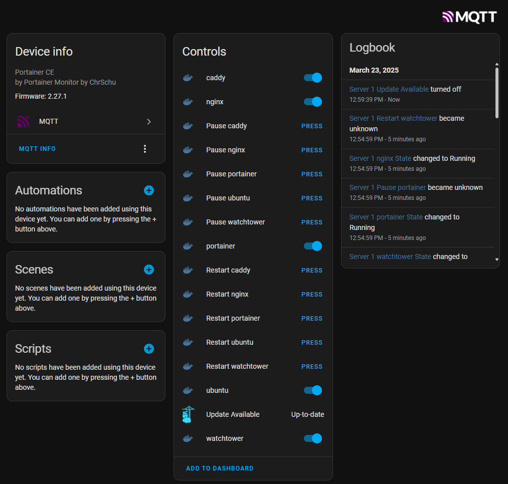
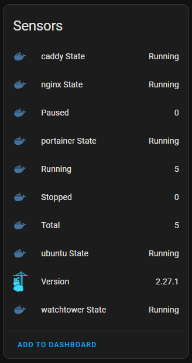
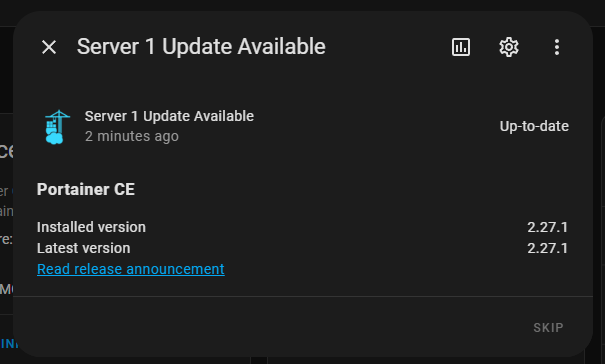
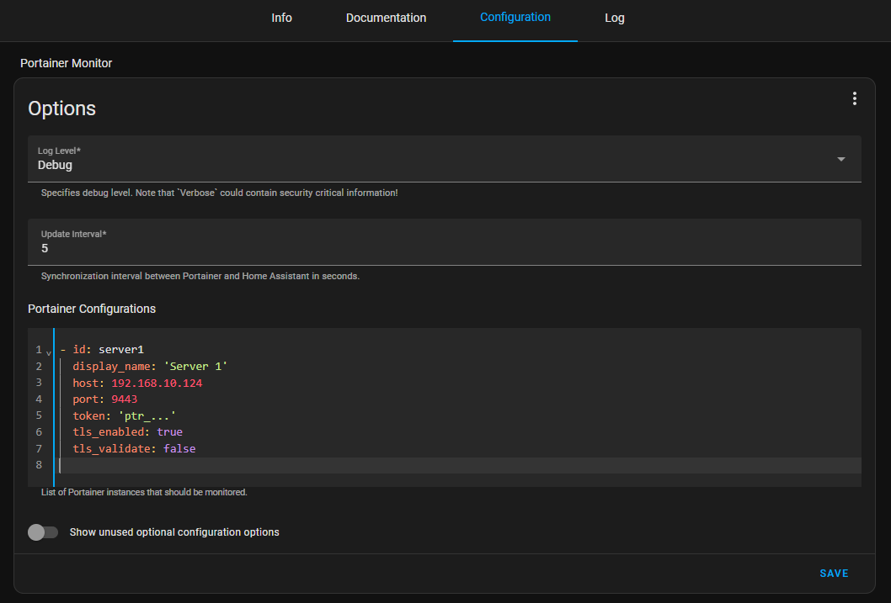

#  Portainer Monitor Addon for Home Assistant

## Features ✔️
- Update Check
- Sensor for actual Portainer version
- Sensor for actual Docker version per Endpoint
- Sensors with amount of `running`, `stopped`, `paused` and `total` containers per Endpoint and Portainer instance 
- Sensors with state of each container (`Created`, `Restarting` ,`Running` ,`Removing` ,`Paused` ,`Exited` ,`Dead`)
- Toggle switch to `start` or `stop` each container
- Buttons to `pause` or `restart` each container




## Installation 🛠️

### Prerequisites 📃
- MQTT Boker [Mosquitto Broker Addon](https://github.com/home-assistant/addons/tree/master/mosquitto) (recommended and available inside store by default) or external MQTT broker. 
- Broker must be connected to [Home Assistant MQTT Integration](https://www.home-assistant.io/integrations/mqtt/) (asks for installation automatically when `Mosquitto Broker Addon` has been discovered).
- [Portainer Access Token](https://docs.portainer.io/api/access#creating-an-access-token) for each configured Portainer connection.

### Home Assistant OS or Supervised
1. Switch on "Advanced Mode" in your users profile. (if you haven't already)
2. Navigate in your Home Assistant frontend to **Settings** -> **Add-ons** -> **Add-on store**
3. Top right three dots and add the repository `https://github.com/ChrSchu90/HomeAssistant.Addon.PortainerMonitor`
4. Refresh Page (`F5`)
5. Store should show the addon and you can install it
6. Click on the "INSTALL" button
7. Add the `Portainer Configurations` inside the options, nothing more is to do (MQTT details are optional and will be taken via Home Assistant API). You can also use secrets e.g. ` token: "!secret token_portainer_server1"`
   >``` yaml
   >- id: server1
   >  display_name: 'Server 1'
   >  host: 192.168.10.124
   >  port: 9443
   >  token: 'ptr_...'
   >  tls_enabled: true
   >  tls_validate: false
   >```
   >

8. Start the addon and check for errors: 
   >

### Standalone (not recommended⚠️)
When using Home Assistant as self managed docker container you can use the container separately. __This is for advanced users only.__

docker compose example (make sure you use the correct architecture like `amd64`, `armv7` or `aarch64`):
``` yaml
version: "3.9"                                                                                                                                   
services:
  ha-portainer-monitor-addon:
    image: ghcr.io/chrschu90/homeassistant-portainer-monitor-amd64:latest
    environment:
      PORTAINER_MONITOR_CONFIG: >
        {
          "log_level": "Info",
          "update_interval": 5,
          "mqtt_host": "192.168.10.123",
          "mqtt_port": 1883,
          "mqtt_user": "mqtt",
          "mqtt_password": "123456",
          "mqtt_tls_enabled": false,
          "mqtt_tls_validate": false,
          "portainer_configs": [
            {
              "id": "server1",
              "display_name": "Server 1",
              "host": "192.168.10.124",
              "port": 9443,
              "token": "ptr_...",
              "tls_enabled": true,
              "tls_validate": false
            }
          ]
        }
```


### Options 🕹
#### General
> [!NOTE]
> MQTT details are optional and will be taken via Home Assistant API, only reqired for `Standalone` installations

| Name              | Required   | Default       | Description                                                                 | Limits                                                     |
| ----------------- | ---------- | ------------- | --------------------------------------------------------------------------- | ---------------------------------------------------------- |
| log_level         | &#10007;   | `Information` | Log output level (⚠️ `Verbose` could contain security critical information!) | `Verbose` `Debug` `Information` `Warning` `Error` `Fatal` |
| update_interval   | &#10007;   | `5`           | Update interval in seconds                                                  | `1` - `120`                                                |
| mqtt_host         | (&#10003;) |               | Hostname or IP of the MQTT Broker                                           |                                                            |
| mqtt_port         | (&#10003;) | `1883`        | Port of the MQTT Borker                                                     | `1` - `65535`                                              |
| mqtt_user         | (&#10003;) |               | User name for MQTT Broker authentication                                    |                                                            |
| mqtt_password     | (&#10003;) |               | User password for MQTT Broker authentication                                |                                                            |
| mqtt_tls_enabled  | &#10007;   | `false`       | Use TLS for MQTT connection                                                 | `true` / `false`                                           |
| mqtt_tls_validate | &#10007;   | `false`       | Validate MQTT connection TLS certificate                                    | `true` / `false`                                           |
| portainer_configs | &#10003;   |               | List of Portainer configurations                                            |                                                            |

#### Portainer Config
| Name              | Required   | Default       | Description                                                                             | Limits                                                    |
| ----------------- | ---------- | ------------- | --------------------------------------------------------------------------------------- | --------------------------------------------------------- |
| id                | &#10003;   |               | Used to create the mqtt IDs                                                             | only `a-z`, `0-9`  and `_` allowed                        |
| display_name      | &#10003;   |               | Displayed name inside HA                                                                |                                                           |
| host              | &#10003;   |               | Hostname or IP of the Portainer API endpoint                                            |                                                           |
| port              | &#10007;   | `9443`        | Port of the Portainer API endpoint                                                      | `1` - `65535`                                             |
| token             | &#10003;   |               | [Portainer Access Token](https://docs.portainer.io/api/access#creating-an-access-token) |                                                           |
| tls_enabled       | &#10007;   | `true`        | Use TLS for Portainer API connection                                                    | `true` / `false`                                          |
| tls_validate      | &#10007;   | `false`       | Validate Portainer API connection TLS certificate                                       | `true` / `false`                                          |
